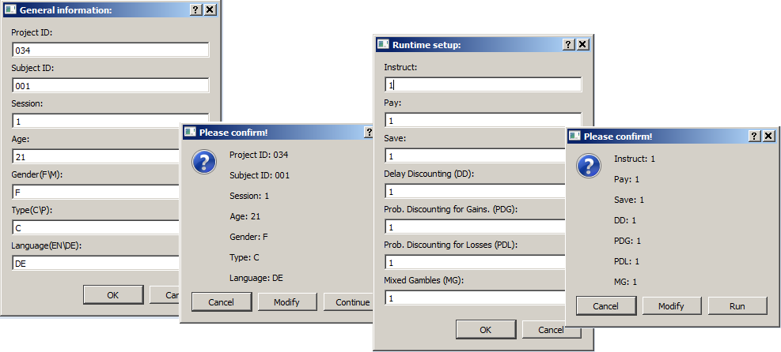
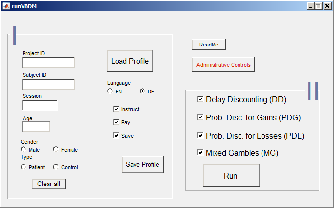

======
VBDM
======
-----------
A value-based decision-making battery to asses impulsive and risky behavior 
-----------

This is an Octave (4.2.0) \\ Matlab (17a) implementation of four behavioral tasks:

    1) Delay Discounting (DD) 
    2) Probability Discounting for Gains (PDG) 
    3) Probability Discounting for Losses (PDL)
    4) Mixed Gambles (MG). 

It starts to input some demographic information of a participant and the 
setup of the battery through some dialog boxes or a GUI  and runs in
full screen provided that Psychtoolbox_ has already been installed.

   
        :Authors: Shakoor Pooseh
        :Contact: Shakoor.Pooseh@tu-dresden.de 

Running the battery
-------------------
- Downlod or clone the repository to your local drive.
- Navigate to the directory.
- In Octave: run the function "runVBDMnoGUI.m".
- Fill in the required information through the upcoming dialog boxes.

- In Matlab: run the function  "runVBDM.m".
- Fill in the required information in the GUI (Matlab).

- Select the tasks you would like to run.

The output is saved in a directory called "data" next to "runVBDM.m"\"runVBDMnoGUI.m".

A brief Introduction
------------
Using simple mathematical models of choice behaviour, we implemented a Bayesian adaptive
algorithm under Octave\Matlab to assess measures of impulsive and risky decision making (`Pooseh et al. 2017`_). 
Practically, these measures are characterized by discounting rates and are used to classify
individuals or groups of populations, distinguish unhealthy behaviour and predict 
developmental courses. The algorithm is based on trial-by-trial observations. 
At each step a choice is made between immediate (certain) and delayed (risky) options. 
Then the current parameter estimates are updated by the likelihood of observing the 
choice and the next offers are provided from the indifference point which would acquire
the most informative data based on the current parameter estimates. 
The procedure continues for certain number of trials in order to reach a stable
estimation.

During each task, participants are supposed to choose one of the two offers presented
simultaneously for 5 seconds on a computer screen. The time limit has been set regarding the
average response time of previous assessments. For each trial the participant’s choice is
highlighted with a frame before presenting the next offer. Presenting the outcomes of gambles
during the experiment and the time interval of each trial as well as the number of trials are
optional and set initially. In general, subjects are informed by an instruction part before each task
that at the end of the experiment one trial per task is selected randomly from their choices and
credited to their compensation. However, instructions are integrated into the battery and can be
modified based on alternative task designs. 

Temporal delays in DD are set to 3, 7, 14, 31, 61,180, and 365 days. For PDG and PDL gambles are
played with five possible probability values: 2/3, 1/2, 1/3, 1/4, and 1/5. The task length for 
DD, PDL and PDG is 50 trials and monetary gains/losses ranges from €3 to €50. For MG, 50 trials 
are played presenting amounts of 1--40 for gains and 5--20 for losses in Euros. The number of trials,
50, was chosen according to data acquired by previous implementations of the algorithm to end up  
with stable estimates. At the beginning of the MG task participants receive €10 as "house money".
During all tasks, offers are randomly assigned to the left or to the right of the screen.

.. _Psychtoolbox:          http: //psychtoolbox.org/
.. _`Pooseh et al. 2017`:  https://link.springer.com/article/10.3758%2Fs13428-017-0866-x
